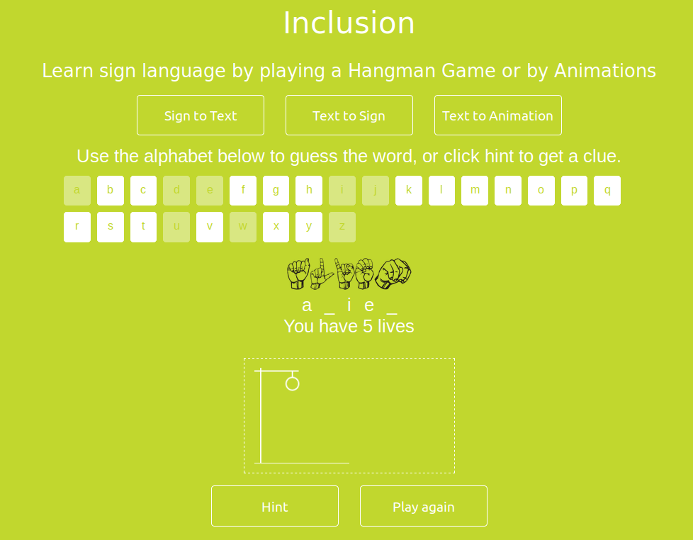
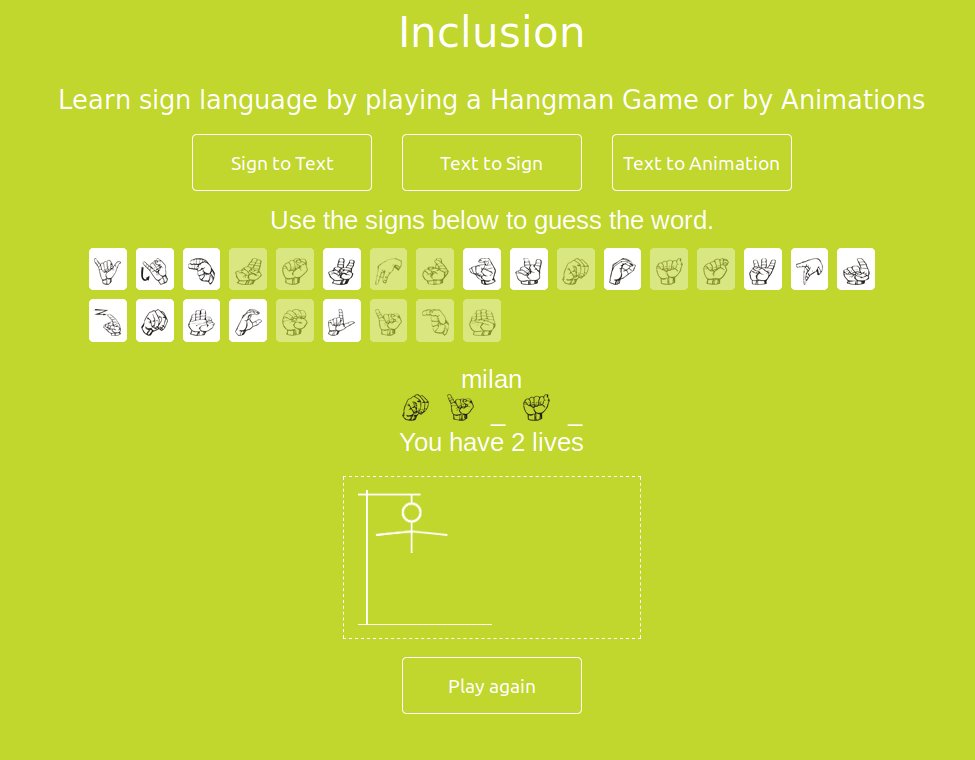

# Inclusion   

This project aims to bridge the communication gap between specially abled people and fully abled people. It aims to educate people in sign language and create awareness by means of games and animations.  

**Team name:** _Inclusion_  
**Contributors:** [Rounak Agarwal](https://github.com/agarwalrounak) and [Naveen](https://github.com/Naveen701372)  

Shortlisted in Top 12 out of 28 participating teams in ***Facebook Build Day 2019***[[1]][[2]] by ***Developer Circles from Facebook***. 

To play, open `index.html` in your browser.

[1]: https://facebookhackday2019.splashthat.com/  
[2]: https://dare2compete.com/o/facebook-build-day-2019-hackathon-developer-circles-from-facebook-86352  

#### Screenshots: 

